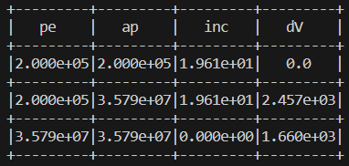

If there is any feature you want to use that is not included in my program, please consider using [GMAT](https://gmat.sourceforge.net/) :3.

---

# OrbitTransCalc

Calculate deltaV for orbit transfer.

A .ipynb file inside can calculate maximum downrange and launch angle with given total dv and burning time.

**Attantion:** Only three out of six orbital elements are used in my program to simplify my code. They are: eccentricity *(e)*, semimajor axis *(a)*, inclination *(i)*. Others like Longitude of the ascending node *(Ω)*, Argument of periapsis *(ω)*, True anomaly *(ν, θ, or f)* at epoch *(t0)* are not defined or assume to be 0.

---

This is just a library. No UI. Please refer to `main.cpp` for useage example.

This project is used to calculate how much deltaV you need to change your orbit. This idea comes from a game: [KSP](https://store.steampowered.com/app/220200/Kerbal_Space_Program/) and its realistic [mods](https://forum.kerbalspaceprogram.com/topic/190040-rp-1-realistic-progression-one-for-ksp-1123/). It only works for ascending/descending node only at pe/ap and using Hohmann Transfer.

It's basically accurate if you don't change your central body. You **can** calculate the planetary transfer, but the result is a little rough.

Please use `cmake` to build this project.

I have a `./start.sh` that automatically use `cmake` to compile and run the code in Linux. If you are using Linux distributions, you can just run the script. If you are using Windows, ~~good luck to you~~ you can manually compile it.

---

### For non-planetary transfer

The deltaV calculated by my program from 200km to GEO. (I slightly changed my orbit's inclination because of enough fuel)

If not changing the inclination:

Here is the 'real' useage in game.

You can see there is a small difference, due to [Principia](https://github.com/mockingbirdnest/Principia) (n-body mod) and the engine taking time to burn, so the result is not that accurate. But it can still give you a big image of how much dV is needed.

### For planetary transfer

To calculate how much dV needs from LEO to Mars/Neptune:

Result:

The result with Mars transfer is much difference (around 30%) to the actual dV requires.

NOTE: I recently studied Restricted Three-Body Problem and I can tell you that my code is just a bad approximation solution. Please just use [cheating paper(dV-map)](https://www.reddit.com/r/KerbalSpaceProgram/comments/3plsvd/for_you_rss_users_a_very_helpful_dv_map_of_our/) with [Transfer Window Planner](https://github.com/Nazfib/TransferWindowPlanner) by alexmoon & TriggerAu & Nazfib. 