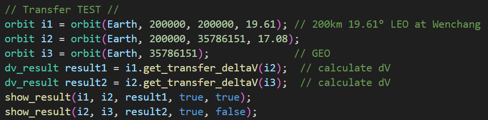

# OrbitTransCalc
Calculate deltaV for orbit transfer within a central body

---

This project is used to calculate how much deltaV you need to change your orbit within a central body. This idea comes from a game: [KSP](https://store.steampowered.com/app/220200/Kerbal_Space_Program/) and its realistic [mods](https://forum.kerbalspaceprogram.com/topic/190040-rp-1-realistic-progression-one-for-ksp-1123/). It only works for 2-body model with no inclination and using Hohmann Transfer.

---

Here is a simple example:

Here is the deltaV calculated by my program.

Here is the 'real' useage in game.

You can see there is a small difference, due to Principia (n-body mod) and the engine taking time to burn, so the result is not that accurate. But it can still give you a big image of how much dV is needed.