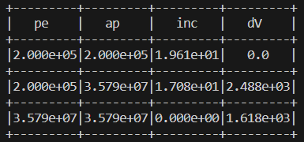
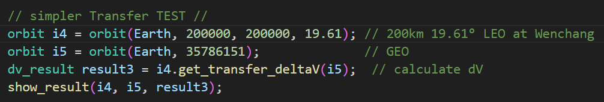

# OrbitTransCalc

Calculate deltaV for orbit transfer.

---

This project is used to calculate how much deltaV you need to change your orbit. This idea comes from a game: [KSP](https://store.steampowered.com/app/220200/Kerbal_Space_Program/) and its realistic [mods](https://forum.kerbalspaceprogram.com/topic/190040-rp-1-realistic-progression-one-for-ksp-1123/). It only works for ascending/descending node only at pe/ap and using Hohmann Transfer.

It's basically accurate if you don't change your central body. You **can** calculate the planetary transfer, but the result is a little rough.

Please use `cmake` to build this project.

---

### For non-planetary transfer

The deltaV calculated by my program from 200km to GEO. (I slightly changed my orbit's inclination because of enough fuel)

If not changing the inclination:

Here is the 'real' useage in game.

You can see there is a small difference, due to [Principia](https://github.com/mockingbirdnest/Principia) (n-body mod) and the engine taking time to burn, so the result is not that accurate. But it can still give you a big image of how much dV is needed.

### For planetary transfer

To calculate how much dV needs from LEO to Mars/Neptune:

Result:

The result with Mars transfer is much difference (around 30%) to the actual dV requires. I haven't figure out why.

But the Neptune transfer result is correct.